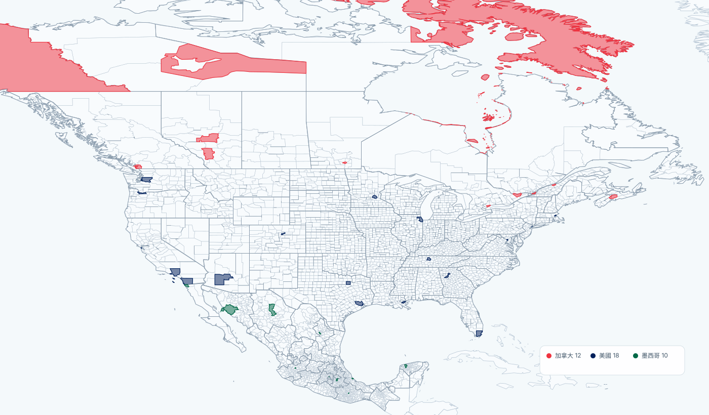

# JourneySphere

JourneySphere 是一個可重用的 Leaflet 地圖元件，用來顯示使用者去過哪些國家與行政區。

它會把已造訪的區域填色，點擊即可切換狀態；地圖資料按國家延遲載入，適合旅行地圖、個人網站或小型旅遊工具。



上圖由 repo 內的 GeoJSON 產生：加拿大 12 個、美國 18 個、墨西哥 10 個已選行政區，共 40 個。未選區域保留線框，選取區域才填入國家色，呈現元件的實際效果。

## 快速使用

目前尚未發佈到 npm，可直接使用 source 或先打包。需要 Leaflet 1.9.4。

```js
import L from 'leaflet';
import 'leaflet/dist/leaflet.css';
import { createJourneySphere } from './src/index.js';
import './src/style.css';

const journey = await createJourneySphere('#map', {
  leaflet: L,
  dataUrl: '/journeysphere-data/',
  visited: [], // 使用 data/catalog.json 裡的 region ID
  onChange: ({ visited, codeword }) => console.log(visited, codeword),
});
```

地圖容器需要指定高度，例如 `#map { height: 580px; }`。把 `data/` 複製到網站的 `/journeysphere-data/`，或直接參考 [範例](examples/index.html)。

## 主要功能

- 已造訪區域以國家顏色填滿，未造訪區域保持簡潔。
- 只顯示已造訪區域的名稱，點擊可開關造訪狀態。
- `getVisited()` / `setVisited()` 管理穩定的 region ID。
- `getCodeword()` / `setCodeword()` 將選擇保存成與 atlas 版本綁定的短字串。
- `reset()` 還原狀態，`destroy()` 清理地圖與監聽器。

## 資料與開發

目前 atlas 包含 259 個地理實體與 248 個國家／地區資料分片。資料來源、覆蓋範圍與授權請看 [data/README.md](data/README.md)；地理資料的授權條件與軟體 MIT 授權分開計算。

```sh
npm test
npm run check
npm run validate:data
npm run pack:check
```
