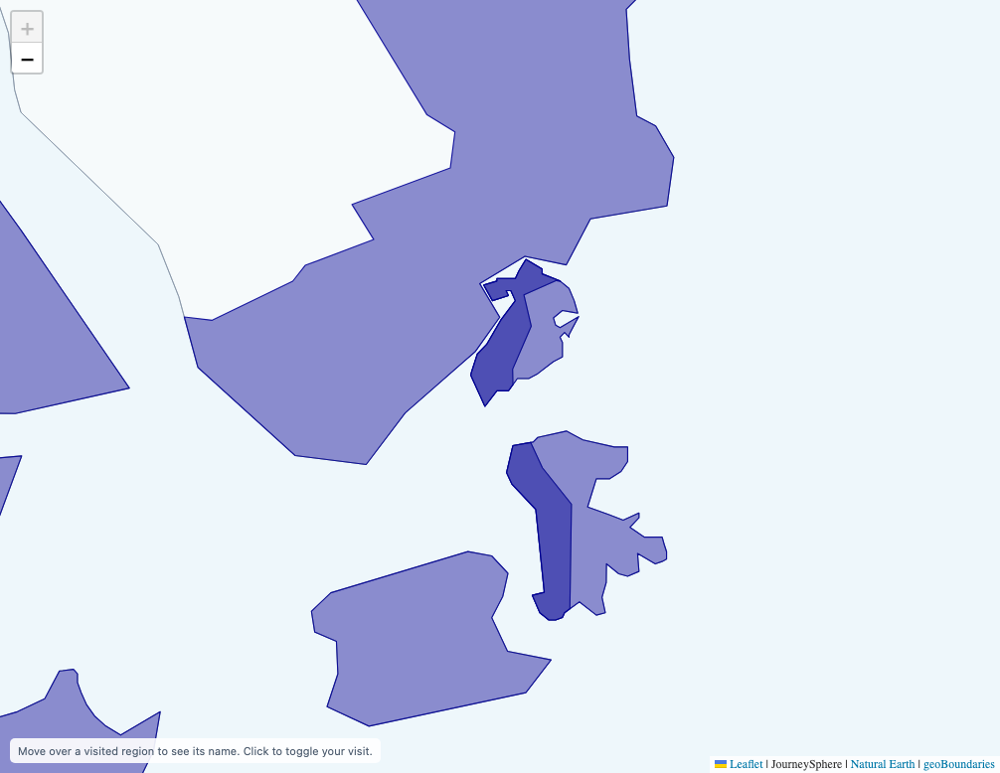
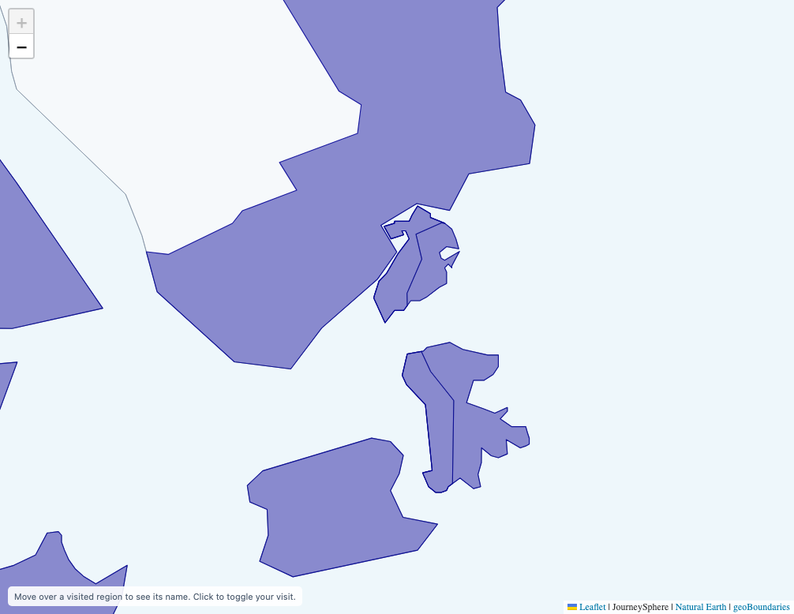

# Uniform visited-region fills

Status: PASS — local working-tree change, 1 October 2026.

Zhuhai (`CHN:ADM2:440400`) and Macao (`MAC:ADM0:MAC`) overlap in the atlas. Painting each selected region separately at opacity 0.44 made the shared area darker, with combined opacity 0.6864. The renderer now paints selected regions into one reusable tile-sized buffer and applies opacity once. World land fills use the same approach. Individual even-odd paths preserve holes; a later region owns overlapping colors, including custom translucent CSS colors. Canonical geometry, visit IDs, interactions and border order are preserved.

Comparison against revision `7f1f06c770fc83f36703c9fa4c4674c24a4a332f`, using the real Zhuhai/Macao records with exact country outlines at zoom 12:

| Interior tile pixel (RGBA) | Before | After |
| --- | --- | --- |
| Both regions selected, inside overlap | 77, 78, 179, 253 | 128, 128, 201, 232 |
| One region selected, inside overlap | 138, 139, 204, 252 | 128, 128, 201, 232 |
| Selected area outside overlap | 129, 130, 201, 232 | 128, 128, 201, 232 |

Both dark patches disappear. The corrected samples match exactly at device pixel ratios 1 and 2. These are canvas pixels before composition over the page background; pixel samples are taken away from strokes and antialiasing edges. [Full fill results](fills-test.json) include sample coordinates.

Before:

After:

Validation: 172 automated checks and 22 fill browser cases pass. Fill coverage includes actual geometry, different colors, translucent CSS colors, holes, opacity 0/0.44/1, Macao-only click/reset, tile reuse, fractional zoom and repeated world copies. The existing detailed coastline and selective-fragment browser suites also pass.

The [flashing regression](flashing-test.json) passes on desktop, mobile and wrapped worlds. Its independent DPR 2 Metal compositor check captured 61 pixel-identical frames across 60 fixed-state repaints, with zero blank frames and zero canvas readbacks during capture. The old flashing control produced 60 blank frames.

Cold-start medians against the same revision, three alternating samples per version after an unmeasured warmup:

| Page | Before | After | Difference |
| --- | ---: | ---: | ---: |
| Desktop embed | 2031 ms | 2038 ms | +6.6 ms |
| Mobile embed | 2032 ms | 2050 ms | +17.7 ms |
| Homepage integration | 2566 ms | 2573 ms | +6.9 ms |

All remain within the existing regression budget (the larger of 100 ms or 5%). The benchmark uses cold cache, gzip, 1.6 Mbps downstream, 150 ms latency and no CPU throttling; timing measures navigation to attached, visible, painted land tiles. The homepage is an in-memory consumer copy with its embed URL replaced; consumer files are not changed. Production CDN geography and TLS are not simulated. Individual samples and refinement checks are in [startup results](startup-results.json).

Reproduce with `npm run check`, `PLAYWRIGHT_MODULE=/path/to/playwright npm run test:fills`, and `PLAYWRIGHT_MODULE=/path/to/playwright npm run test:flashing`. For the timing comparison, run `BASELINE_REF=7f1f06c7 PERF_SAMPLES=3 PLAYWRIGHT_MODULE=/path/to/playwright npm run test:refinement`. On supported macOS hardware, set `PLAYWRIGHT_GPU_BACKEND=metal` for the hardware compositor check.
