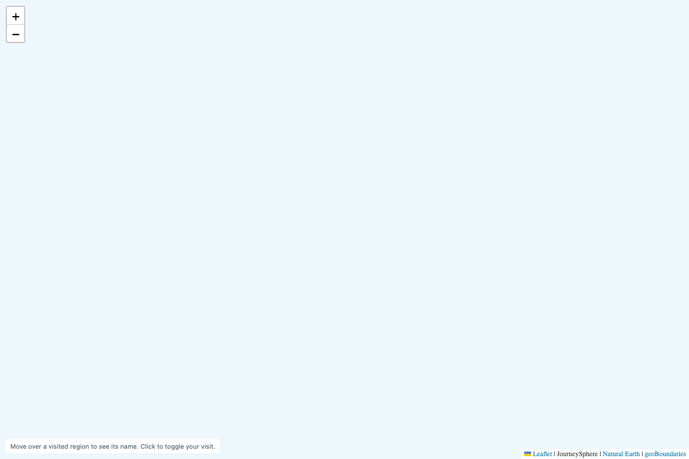
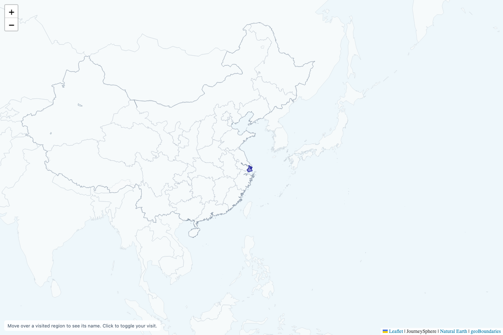
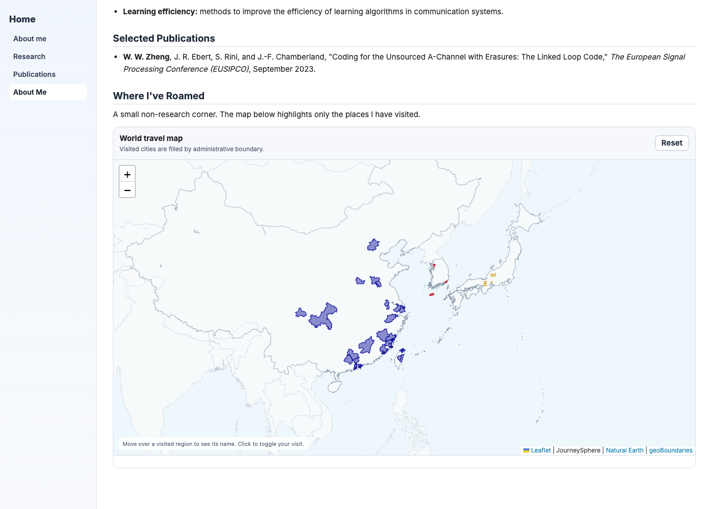

# Map flashing regression

Status: PASS

The previous renderer removed visible canvas tiles during each repaint. Their replacements stayed hidden until the next animation frame, producing a brief blank map. The corrected renderer paints through a reusable detached canvas into the existing tiles. It also marks fully drawn new tile batches ready synchronously, covering instant view changes, and skips outline updates that do not change visible geometry.

Frame-by-frame browser comparison with revision `3503a3c77c684dcd9305f7f889b1044ed97a11d5`:

| Renderer | Scenario | Sampled blank frames |
| --- | --- | ---: |
| baseline | desktop | 13 |
| current | desktop | 0 |
| current | mobile | 0 |
| current | wrapped-world | 0 |

Checks include staggered outline arrivals, real clicks, reset, cached refinement thresholds, animated and instant fractional zooms, and repeated world copies. Fixed-view updates retain loaded tile identities. Every monitored frame checks actual visibility and land pixels; selected colors remain visible throughout refinement. No uncaught browser errors occurred. Coarse world-only Guam omits local land in the existing overview source, so its land-pixel assertions begin after exact coverage arrives.

Cold-start comparison uses three alternating samples per version on desktop and mobile, gzip, disabled cache, 1.6 Mbps downstream, 150 ms latency and no CPU throttling. No consumer website is included.

| Page | Previous first map | Current first map | Difference |
| --- | ---: | ---: | ---: |
| embed-desktop | 2027 ms | 2029 ms | 2.7 ms |
| embed-mobile | 2027 ms | 2032 ms | 4.7 ms |

These measured differences remain well within the existing regression budget (the larger of 100 ms or 5%). Production CDN geography and TLS are not simulated. Exact runtime hashes and individual timing samples are in [startup-results.json](startup-results.json).

Validation: all 166 automated checks pass, alongside cross-origin startup, live-update recovery, full coastline interaction, selective fragments, and the new frame regression. Fractional wrapping, visit clearing, drawing-failure recovery, native loading-event ordering and reentrant removal remain covered.

Run `npm run check` and `PLAYWRIGHT_MODULE=/path/to/playwright npm run test:flashing` to repeat the automated and browser checks.

## Published homepage follow-up — 1 October 2026

The live homepage still loaded `cd88b044655967c8d103e0b2b9c0abf891694294`, whose tile renderer is identical to the flashing baseline above. Updating the library's main branch did not change that immutable consumer URL. The local homepage now pins the already published fix at `ff0d7d6b095a4b1278e37fc5e40af1410614e864`; this consumer edit has not been committed or pushed.

A plain local copy of the homepage loaded the real CDN release, without the development preview's module substitution. During boundary arrivals, the old release produced 19 blank sampled frames and a captured blank compositor image; the updated consumer produced none. After all visible outlines finished, each version was observed for another 60 seconds: 3,602 sampled frames, no blank frames, map events, DOM mutations, or resize callbacks. No JavaScript canvas readback was used during compositor capture. Runtime URLs, CDN revision headers, source hashes, and compact results are in [cdn-consumer-results.json](cdn-consumer-results.json).

The real CDN run measures correctness, not comparable cold-start performance. Different CDN cache states affected downloads, and its first loaded-map observations are upper bounds, rather than precise first-display marks. Full refinement completed after the map was already usable.

An independent Apple M5 Metal GPU check at device pixel ratio 2 kept all 61 compositor frames pixel-identical across 60 repeated fixed-state repaints. Its old-renderer control captured 60 blank frames. Fractional display scales 1.1, 1.25, 1.5, and 2, including adaptive viewport changes, also settled without further repainting or resizing loops.

The browser regression now includes fresh pages with canvas readbacks blocked during compositor capture. It checks 60 fixed-state redraws, decodes the screenshots only after capture stops, and requires unchanged RGBA pixels and zero blank frames for the corrected renderer. The old release must reproduce a real blank frame as a control. This additional regression passed with Metal graphics; use `PLAYWRIGHT_GPU_BACKEND=metal` on a supported macOS machine to reproduce the hardware run. [flashing-test.json](flashing-test.json) records the backend and results.

